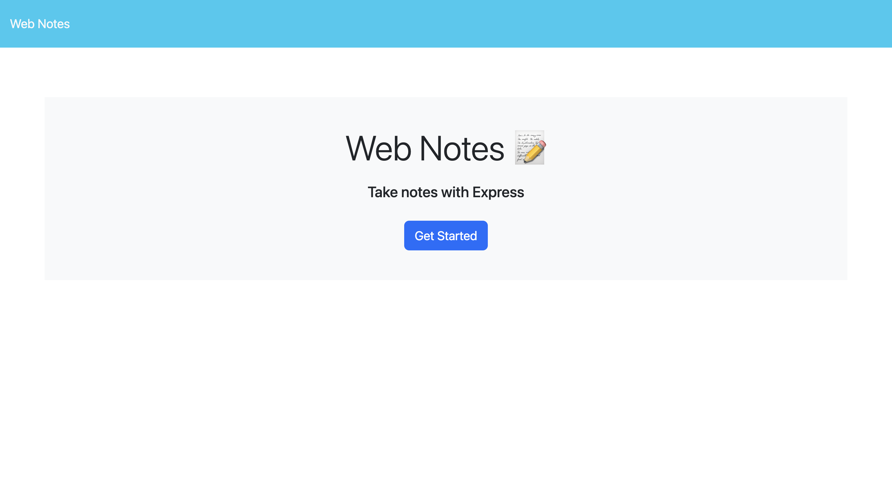

# Web Notes

## Description

Web Notes is an online website where you can take notes and keep track of them. I built this project to practice using Express.js, to create routes to different HTML pages and routes for the website’s API. It was interesting to see how a website processes different requests and URLs, depending on their structure and method. Basically, this is how the front end of a website communicates with its back end and vice versa. With this knowledge I now understand the purpose of URLs and web APIs, since they help pass information between the different parts and components of a website.

## Table of Contents

- [Installation](#installation)
- [Usage](#usage)
- [Credits](#credits)
- [License](#license)

## Installation

No installation is required, you just need to visit the website, by clicking on the following link: https://web-notes-jmpv.onrender.com

## Usage

1. To start using Web Notes you first need to go to its website, by clicking on the following link: https://web-notes-jmpv.onrender.com After you click on the link, you should see the website’s homepage.
   

2. Then click on the “Get Started” button, to go to a webpage where you can visualize, create and delete all your notes. The button should redirect you to the following webpage, when you click on it.
   

3. To create a note, you must fill the following form and click on the “Save Note” button that will appear on the header, when you fill out the form completely. When you click the button, the note will be saved, the form will be cleared, and the note will appear in the sidebar of the webpage, along with a red “Trash can" delete button to its right.
   
   

4. To select the created note, just click on it. And the form will display the note’s information instead. To use the form again, click on the “New Note” button that now appears in the header.
   

5. To delete a note, click on its red “Trash can” delete button, and the note will be deleted.
   
   

## Credits

- For understanding how optional chaining works:
  - Mozilla. (n.d.). Optional chaining (?.). Optional chaining (?.) - Javascript | MDN. https://developer.mozilla.org/en-US/docs/Web/JavaScript/Reference/Operators/Optional_chaining

## License

This project uses the MIT license.
